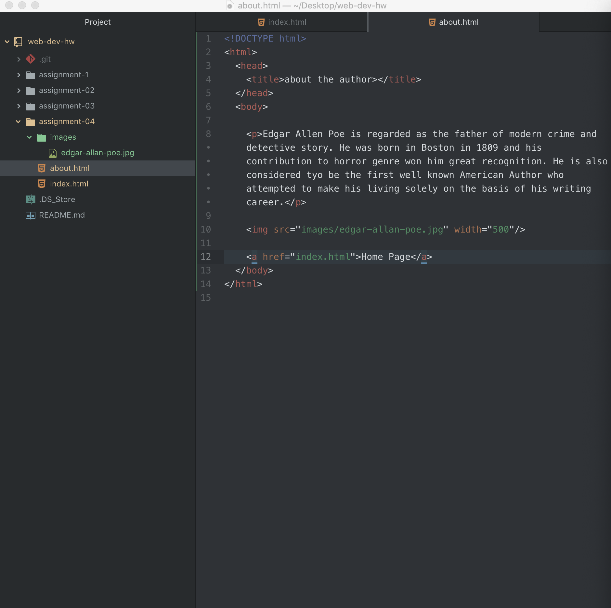

# Assignment 4
## Questions
13. On The Wayback Machine, I chose to go to the site www.sagaouterwear.com. The site this far back is so much different looking than how it is nowadays. The main thing I noticed is how much there is a lack of color and how much more bland it is. Within 12 years, they surely have improved their site with better graphics and overall quality.

14. In the GIT module I learned how to use GitHub Desktop and increase my skills for coding. I think that the program was overall confusing and difficult because I'm new to it but I really like how you can see your history and how easy it is to correlate with your repo.

15.

