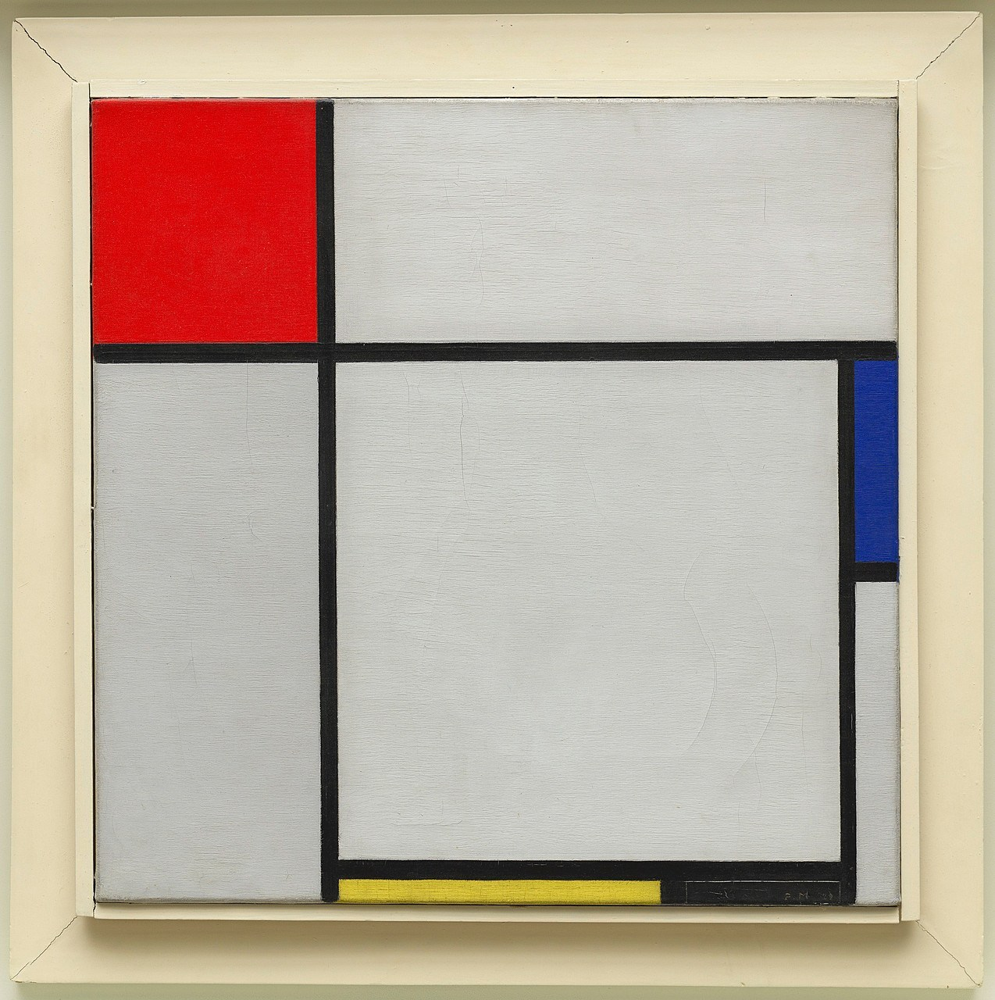

# Questions
## 13.
In web design, padding goes around all four sides of the content in a created box. It basically creates some extra space for the content so it does not look so crammed. The margin is the space between the border of the box or element and the next element coming after it. The border is a unique rectangle or shape around the element that you can change the size and color of.

## 14.
Composition.

## 15.
This project was one that took a lot of time and patience. Starting out I went to go find a pice of artwork that I wanted to use. I came across a cool piece of work called "composition." After this, I went on to start creating boxes and shapes that resembled the image to the best of my ability. This is what was hard for me, trying to figure out different things to use to make the image work and be in place. Figuring out how to center the image and making the image stay in one place was difficult but I finally figured it out. Lastly, I put the finishing touches on with my name and colors.
